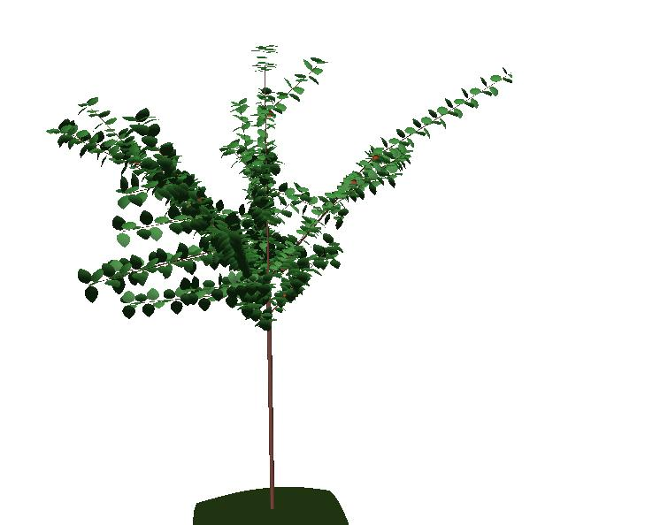

.. mapplet documentation master file, created by

Stocatree User Guide
####################

   *Simulated apple tree using Stocatree in LPy (python version of MAppleT)*

Openalea.StocaTree is a Python package that provide a Lsystem dedicated to 
simulation of apple trees over several years, by taking into account statistical properties
and bio-mechanics. It is based on an original model developed by **Colin Smith**, which 
is called **MAppleT** [ref1]_ . This model is made of a C++ library and a Lsystem to be
used within LStudio.

OpenAlea.StocaTree provides a Lsystem (in python) to be used with **VPlants.Lpy**, a Python implementation of 
L-Studio. The advantage of Stocatree is to provide a multi-platform version of MAppleT.

.. topic:: The main goals of stocatree:

   * show the feasibility of large L-system implementation in LPy, which is currently done (e.g., see Results section)
   * Update and improve Stocatree with respect to the original MAppleT code by
        * making the statistical models more realistic
        * making the biomechanical model faster and reusable by other models
        * including light interception

.. toctree::
    :maxdepth: 1

    Quick start <quick_start.rst>
    code.rst
    results.rst
    lpy_versus_lstudio.rst
    mapplet.rst
    developer.rst

.. toctree:: 
    :hidden:

    biblio.rst

.. sectionauthor:: Thomas Cokelaer
